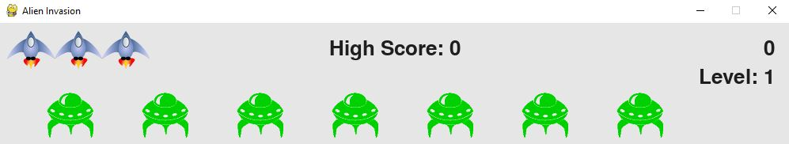
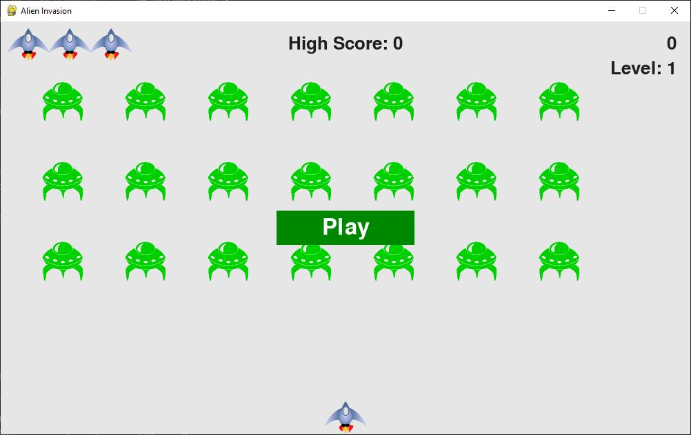
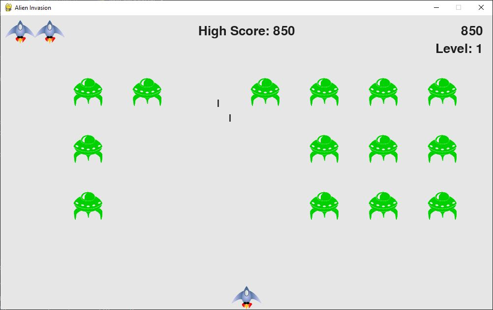

# Alien Invasion - Python Game



Welcome to Alien Invasion, a simple and fun game created in Python! This project is part of my personal portfolio and was developed to enhance my programming skills. Developed while studying the book ["Python Crash Course, 3rd Edition"](https://ehmatthes.github.io/pcc_3e/) by Eric Matthes, which is copyrighted © 2023.

## Table of Contents

- [Overview](#overview)
- [Requirements](#requirements)
- [How to Play](#how-to-play)
- [Game Settings](#game-settings)
- [Screenshots](#screenshots)
- [Contributions](#contributions)
- [License](#license)

## Overview

Alien Invasion is a classic shooting game where you control a spaceship, and your mission is to destroy the alien Invasion trying to conquer Earth. The game was created using the Pygame library and Python 3.

## Requirements

Before playing Alien Invasion, make sure you have Python 3 and the Pygame library installed on your system. You can install them using the following command:

```bash
pip install pygame
```

## How to Play

**1. Clone the repository:**
  ```bash
  git clone https://github.com/tiagocazali/Game_Project.git
  ```

**2. Navigate to the game directory:**
  ```bash
  cd Game_Project
  ```

**3. Start the game:**
  ```bash
  python alien_invasion.py
  ```

**4. Use the arrow keys to move the spaceship and press the spacebar to shoot at the alien Invasion.**

**5. Press "q" to close de game.**


## Game Settings

You can customize the game by editing the settings in the "Settings.py" file. Here are some of the key settings that you can adjust:
ATTENTION: Some settings, if wrong configured, can make the game crash!

- **Screen Settings:**
  - `isFullScreen`: Set to `True` for fullscreen mode.
  - `screen_width` and `screen_height`: Adjust the screen size.

- **Ship Settings:**
  - `ship_lives`: Set the number of lives for your spaceship.

- **Bullet Settings:**
  - `bullet_width` and `bullet_height`: Adjust the bullet dimensions.
  - `bullet_color`: Change the bullet color.
  - `bullet_allowed`: Set the number of bullets allowed on the screen.

- **Aliens Setting:**
  - `fleet_drop_speed`: Adjust the speed at which the alien fleet moves down.
  - `speedup_scale`: Determines how quickly the game speeds up.
  - `score_scale`: Controls how quickly the alien point values increase.

- **Initialize Dynamic Settings:**
  - These settings control the dynamic aspects of the game, such as ship speed, bullet speed, alien speed, and more.

- **Increase Speed:**
  - The `increase_speed` method increases game speed settings to make the game more challenging.

Feel free to modify these settings in the "Settings.py" file to tailor the game to your preferences.

## Screenshots




## Contributions

Contributions are welcome! If you would like to contribute to this project, follow the steps below:

1. Fork this repository.
2. Create a new branch for your feature: `git checkout -b my-feature`
3. Commit your changes: `git commit -m 'Add a new feature'`
4. Push your changes: `git push origin my-feature`
5. Open a Pull Request

## License

This project is licensed under the [MIT License](LICENSE), which means you are free to use and modify it as you see fit. However, be sure to give proper credit when using this code in your own project.

Enjoy playing Alien Invasion, and thank you for checking out my project!
